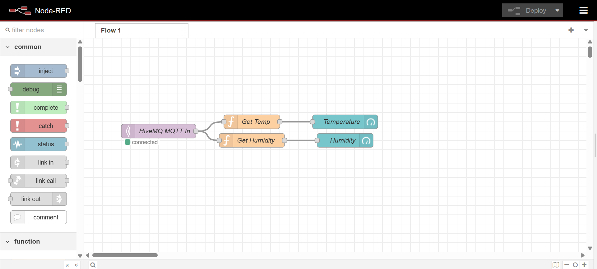
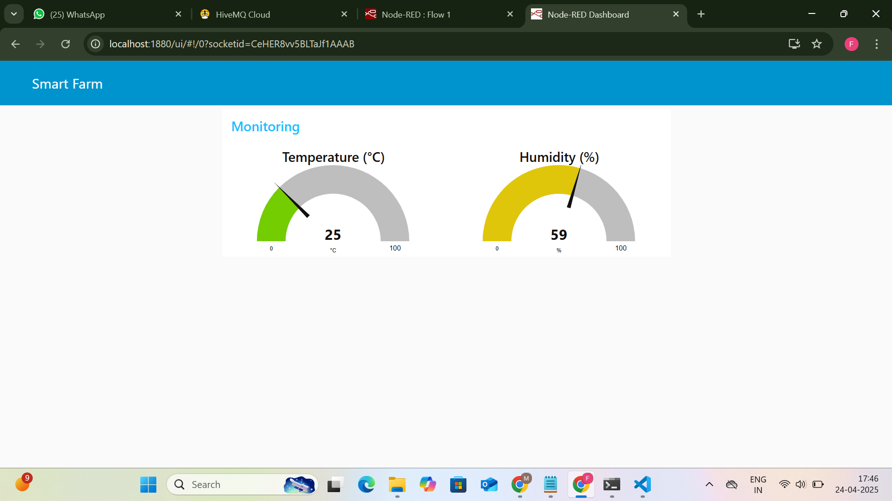
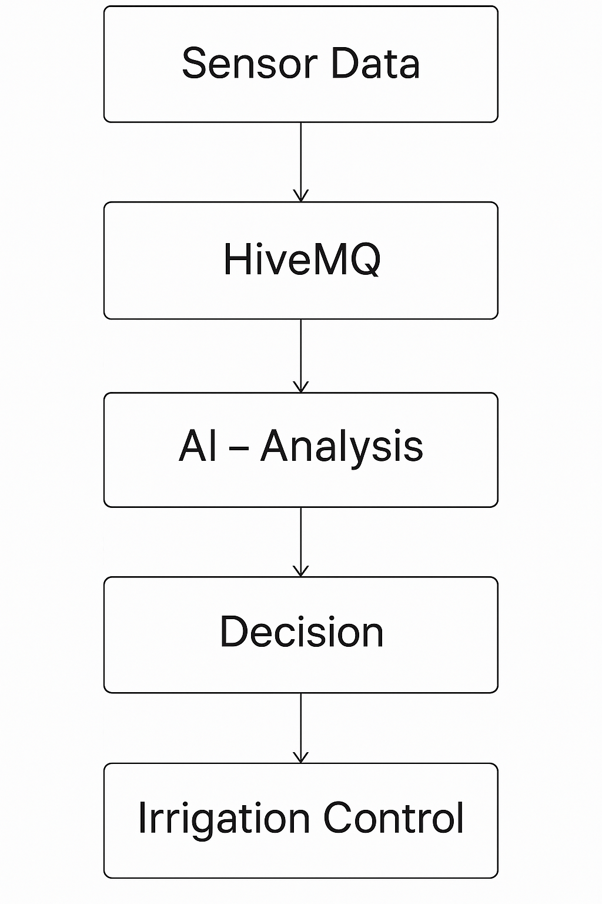
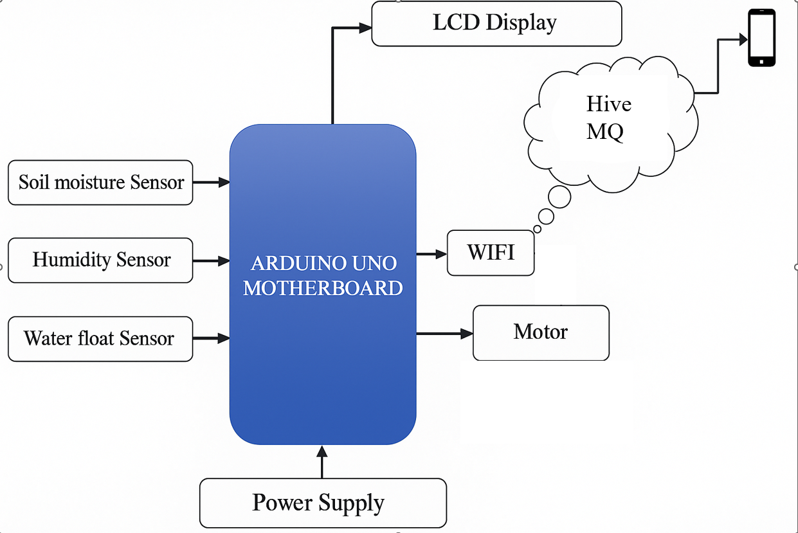

# 🌾 AI-Driven IoT-Based Smart Agriculture System

An IoT and cloud-based smart farming system that monitors soil, temperature, and humidity levels in real-time using sensors and automates irrigation using Node-RED and MQTT (HiveMQ). This project was developed as part of a B.Tech academic curriculum to demonstrate the potential of precision agriculture with emerging technologies.

---

## 📖 Abstract

This project presents a smart agriculture solution that integrates sensors, cloud computing, and Node-RED for real-time monitoring and automation. Key soil and environmental parameters like soil moisture, temperature, and humidity are collected and transmitted to HiveMQ, where Node-RED processes the data and triggers irrigation decisions.

---

## 🔧 Features

- 🌐 Real-time remote soil and climate monitoring
- 💧 Automated irrigation based on soil moisture
- ☁️ MQTT-based communication via HiveMQ Cloud
- 📊 Node-RED dashboard for visualization and control
- 📡 Weather integration with OpenWeather API

---

## 🧱 System Components

| Component               | Description |
|-------------------------|-------------|
| **Arduino UNO**         | Main microcontroller |
| **Soil Moisture Sensor**| Measures soil moisture level |
| **DHT11 Sensor**        | Measures temperature and humidity |
| **Water Float Sensor**  | Monitors water level in tank |
| **Wi-Fi Module (ESP8266)** | Sends data to HiveMQ |
| **LCD Display (16x2)**  | Displays sensor data |
| **Relay Module**        | Controls irrigation motor |
| **Water Pump / Motor**  | Performs irrigation |
| **Power Supply**        | Provides necessary voltage |
| **HiveMQ**              | Cloud MQTT Broker |
| **Node-RED**            | Data processing and dashboard UI |

---

## 📂 Project Structure

Smart-Agriculture-System/
├── README.md
├── hardware/
│ ├── circuit_diagram.png
│ └── component_list.md
├── software/
│ ├── node_red_flows/
│ │ ├── main_dashboard_flow.json
│ │ ├── soil_sensor_flow.json
│ │ └── weather_api_flow.json
│ └── test_values.py
├── docs/
│ ├── Smart_Agriculture_Report.pdf
│ ├── Research_Paper.pdf
│ └── Project_Presentation.pptx
├── images/
│ ├── dashboard_screenshot.png
│ ├── sensor_data_1.png
│ ├── sensor_data_2.png
│ ├── flowchart.png
└── LICENSE (optional)

---

## 🖼️ Visuals

### 🔌 Node-RED Dashboard

### 🌡️ Sensor Output Samples

### 📊 System Flowchart

### 🔧 Conceptual Circuit Diagram

---

## ✅ How to Use

1. Connect sensors (soil moisture, DHT11, float) to Arduino Uno.
2. Connect Arduino to Wi-Fi module (ESP8266).
3. Upload Arduino code to send sensor values to HiveMQ MQTT broker.
4. Import Node-RED flows from `software/node_red_flows/`.
5. View live sensor data on the Node-RED dashboard.
6. Adjust irrigation logic in Node-RED based on threshold values.

---

## 📈 Results

| Parameter         | Traditional Method | Smart System |
|------------------|--------------------|--------------|
| Water Usage      | High               | Reduced by ~35% |
| Monitoring       | Manual             | Real-time (automated) |
| Decision Making  | Farmer's judgment  | Sensor + Threshold logic |
| Labor Required   | High               | Minimal |

---

## 📘 Documentation

- 📄 [Project Report (PDF)](docs/Smart_Agriculture_Report.pdf)
- 📄 [Research Paper (PDF)](docs/IRP-1642_Final_Manuscript.pdf)
- 📊 [PowerPoint Presentation](docs/Project_Presentation.pptx)
- 📋 [Component List](hardware/component_list.md)

---

## 👨‍💻 Author

**Mohammad Faiz Shaikh**  
B.Tech in Computer Science & Engineering  (Batch 2025)
Integral University, Lucknow

---

## 📜 License

This project is open-source under the [MIT License](LICENSE).